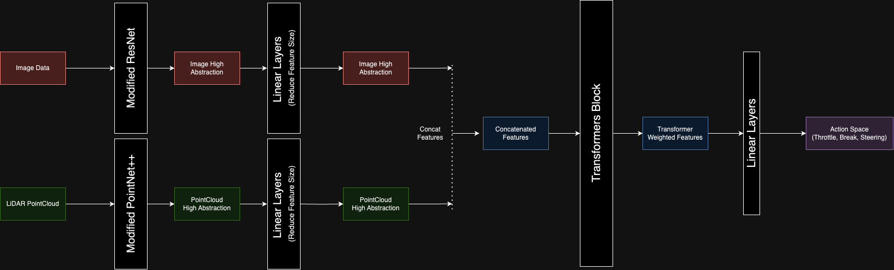
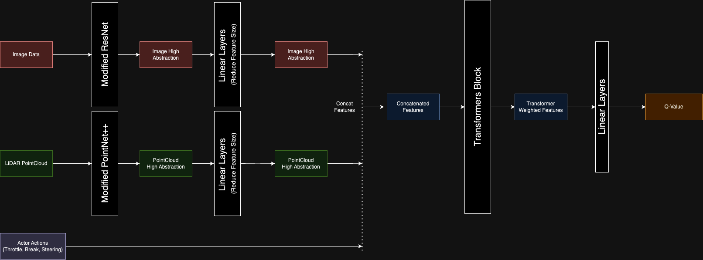

# Simple Autonomous Driving Model
___
Author: Muhammad Aufa Helfiandri

> Note: be informed that this project is still largely unfinished

## Imitiation Learning

To initialize the weight for the reinforcement learning model, I use Behavior Cloning on an preacquired data. Ideally, this should be done using Human Driver. However, in this project I utilize CARLA Autopilot's as the expert.

CARLA Autopilot uses a rule based system to control the vehicle by an omniscient data, meaning that it have access to perfect information about the environment (ex: Location of each vehicles, pedestrian, street shape, road condition) that would not be available in practice during real world driving scenarios. This makes the Autopilot an ideal, though artificial expert for training purposes

### Data Collection

Data collected from CARLA Autopilot includes:
1. Front Camera Images
2. LiDAR Point Clouds
3. Front, Right, and Left Radar (Recorded Although still unused)
4. Action taken by vehicles (Throttle, Steering, Break)

The agents was set to drive in the simulation for around 2-3 hours, collecting sensor data continuously. The environment featured a variety of urban driving scenarios, including intersections, pedestrian crossings, and highway segments. To simulate real-world complexity, the environment also included varying weather conditions such as rain, fog, and different times of day, allowing the model to learn from diverse driving experiences.

The Data Collection is done using [carla_collector.py](carla_collector.py)

### Training

The model is trained using behavior cloning, where it learns to mimic the expert's behavior by minimizing the loss between its predicted actions and the actions taken by the CARLA Autopilot. The loss function used is Mean Squared Error (MSE), comparing the predicted and actual steering angles, throttle values, and braking inputs.

## Reinforcement Learning (Using Soft-Actor Critic)
___

### 1. Actor Neural Network Architecture

Actor Neural network is the main Neural Net designed to predict the action taken by Model. It consist of 2 parts, Feature Extraction and Sensor Fusion. 

#### Feature Extraction

Feature Extraction are designed to be able to extract the high level of sensor features (currently only for Camera and LiDAR), though to add other sensors (such as Radar, etc) to the model it's as simple as plugging another Feature Extraction model before the Sensor Fusion.

##### - ResNet

ResNet are used to extract high abstraction from Images. The original weight before training uses ImageNet pretrained weight provided by Torchvision (and Tensorflow.applications)

##### - PointNet++

PointNet are used to extract high abstraction from LiDAR point cloud. The PointNet++ architecture are based from https://github.com/charlesq34/pointnet2  and https://github.com/yanx27/Pointnet_Pointnet2_pytorch for the PyTorch version (both are used for Segmentation and Classification task). However, to extract features from the Point Cloud we only maintain the up to the last PointSetAbstraction which will return the high abstraction from the Point Cloud. 

##### - Linear Layers

For both Image and PointCloud features The High Abstraction are run through several Linear/Dense layers to reduce the dimension while maintaining informations.

#### Sensor Fusion

After both High Abstraction was extracted, the features were concatenated and run through a Transformers Layer. The Transformers attention mechanism enables the model to focus on important elements from each sensor modality.

##### - Transformers Block

The attention mechanism in the Transformer block helps the model focus on different sensor features based on the current driving context. This improves the model's ability to fuse data from multiple sensors effectively.

##### - Linear Layers

Finally, the concatenated features are passed through additional linear layers to output the predicted actions (steering, throttle, brake).

### 2. Critic Neural Network Architecture

The Architecture of the Critic Neural Network largely the same as the Actor Network with 2 key differences. There're an additional input in the form of Actor Actions (Throttle, Break, Steering) and the output is one vector which represent the Q-Value.

The Critic neural network evaluates the actions taken by the Actor network. It provides feedback to the Actor by assessing the quality of the predicted actions with respect to the current state of the environment.

The Critic is designed to quantifies how beneficial the current state-action pair is, which guides the Actor in improving its policy. It includes layers for state encoding, sensor fusion, and finally, outputting a scalar value representing the action-value (Q-value) for the given state-action pair.

### 3. Soft-Actor Critic

Soft-Actor Critic (SAC) is a Reinforcement Learning Algorithm designed for Continuous Action Space, which makes it well-suited for autonomous driving tasks. The training involves alternating between updating the Actor and the Critic networks. 

The Architecture of SAC includes the following:
- **Actor Network** : 
The Actor network is responsible for predicting actions based on the state of the environment, which includes sensor inputs like camera images, LiDAR, and other data. The Actor network learns to generate a probability distribution over actions, with the goal of selecting actions that maximize the long-term reward.

- **2 Critic Network (Q-Value)** :
The two Critic networks (Q-value critics) are designed to estimate the Q-values, which represent the expected cumulative reward for a given state-action pair. These networks take both the state (sensor inputs) and action as inputs and output a Q-value. Each Critic network independently computes the Q-value for the same state-action pair, and the minimum of the two values is used during training to provide a conservative estimate of the true value.

- **2 Soft Critic / Target Network** :
The Soft Critic networks, also known as target networks, are used to provide stable Q-value targets for the Critic networks during training. These target networks are updated more slowly than the main networks, providing smoothed estimates of future Q-values, which helps to stabilize learning. The target Q-values are calculated using the outputs from the Soft Critics and are used as a reference for updating the Main Critics, minimizing the difference between predicted and target values.

The training process involves alternating between updating the Actor and Critic networks. In SAC, the Actor learns to maximize the expected cumulative reward while maintaining sufficient exploration, and the Critic evaluates the actions taken by the Actor, providing feedback on their effectiveness.
